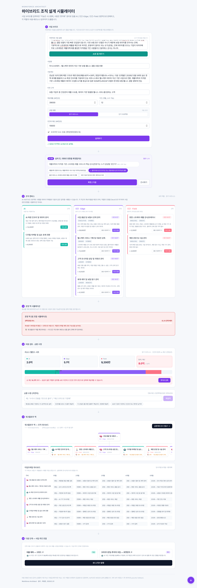
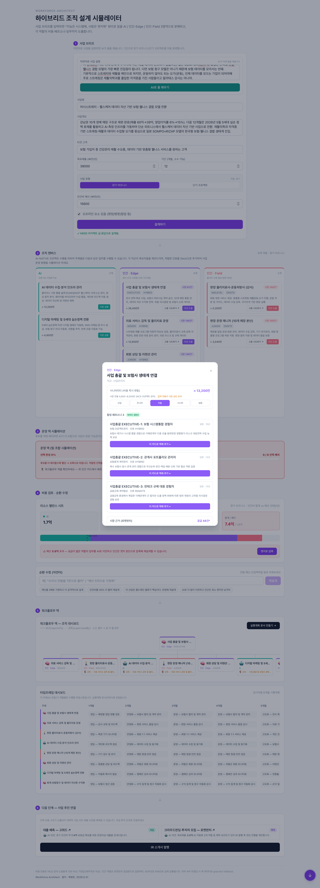
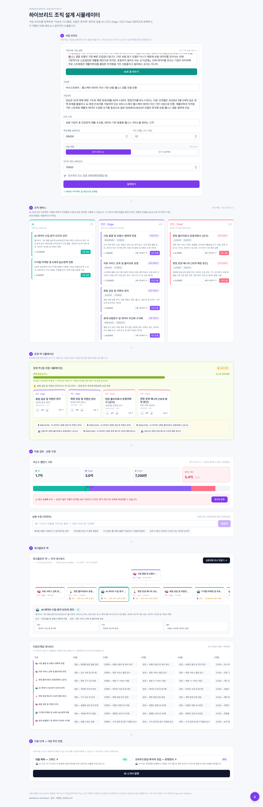

# Workforce Architect — AI-네이티브 조직 설계 시뮬레이터

> **사업 브리프만 입력하면, 무엇을 AI에 맡기고 무엇을 사람이 해야 할지까지 설계해주는 AI-네이티브 컴퍼니 빌더.**
> 사람을 뽑기 전에, 각자의 임무가 적힌 실행 문서를 손에 쥐여줍니다.

| | |
|---|---|
| **데모** | https://workforce-architect.vercel.app |
| **GitHub** | https://github.com/KAI-IP/workforce-architect |
| **스택** | Next.js 14 · TypeScript · Tailwind CSS · Vercel |
| **사용 API** | MISO API · 로켓펀치(RocketPunch) API · NCS 국가직무능력표준(공공데이터) · Tower Standalone(Apache-2.0 OSS) |
| **빌더** | 복병준 · 2026.5.31 |

> ※ 해커톤 종료로 외부 API가 중단될 수 있습니다. 본 문서는 **API가 동작하던 시점의 결과물·스펙을 박제**한 기록입니다. (외부 API 미응답 시 제품은 목 데이터로 graceful fallback 하도록 설계되어, 데모 자체는 계속 동작합니다.)

---

## 1. 한눈에 보기

Workforce Architect는 **사업 브리프(자연어/폼)를 입력하면 AI가 일을 `AI / 인간-Edge(사고형) / 인간-Field(행동형)` 3영역으로 분해**하고, 각 역할의 **비용·페르소나·임무·조직관계·시행계획**까지 도출하는 조직 설계 시뮬레이터입니다.

핵심 사상은 Block의 **"지능은 시스템에, 사람은 엣지에(Intelligence in the system, people at the edge)"** — 무엇을 AI에 맡기고 무엇을 사람이 해야 하는지를 **사람을 뽑기 전에** 설계합니다.


*▲ 상하 6단계 플로우: 브리프 → AI 질문 → 조직 캔버스 → 운영 덱 → 비용·순환수정 → 워크플로우 덱 → 다음 단계*

---

## 2. 왜 지금 이 제품인가 (해결하는 문제)

새 사업을 시작할 때 사람들은 관성적으로 **'재무팀·인사팀·마케팅팀'부터 뽑고**, 사람을 다 채운 뒤에야 일을 시작합니다. 그 결과:

- AI로 자동화하면 될 **반복 업무에 사람을 쓰고**,
- 정작 사람만이 할 수 있는 **윤리·신뢰·현장 판단은 비어버려**,
- 막대한 **인건비와 시간이 낭비**됩니다.

AI 시대의 진짜 질문은 **"무엇을 AI에 맡기고, 무엇을 사람이 해야 하는가"** 인데, 이를 **사업 시작 전에** 설계해주는 도구가 없습니다. → 검증되지 않은 직감으로 조직을 꾸리고, 뽑은 뒤에 후회합니다. **관성적 채용이 만드는 자원 낭비**가 우리가 푸는 사회적 문제입니다.

---

## 3. 타깃 사용자

- 신규 사업·신사업·단발 프로젝트를 시작하는 **창업자, 소상공인, 신사업·전략 담당자, PM**
- 2주짜리 **팝업스토어(단기 프로젝트)**부터 다점포 **장기 비즈니스**까지
- **AI를 도입하고 싶지만 조직 설계 경험이 없는** 비전문가
- **인건비 예산이 한정된** 초기 팀 — '뽑기 전 시뮬레이션'의 가치가 큼

---

## 4. 핵심 개념 — 3레인 분해

| 레인 | 정의 | 색 | 예 |
|---|---|---|---|
| **AI** | 조합 가능·자동화 가능한 반복 업무 | teal | 추천·CRM, 마케팅 콘텐츠, 수요예측 |
| **인간 · Edge** | 윤리·신규·고위험·신뢰·가드레일 — 위임 불가한 사고형 판단 | violet | 전문 검수, 고위험 상담, 법무, 운영 총괄 |
| **인간 · Field** | 물리적 신체가 필요한 현장 행동형 | coral | 배송, 설치, 시공, 현장 운영 |

> 차별 포인트: **`reportsTo`(보고 계통)와 `supervisedBy`(감독 책임)를 분리** → "감독 없는 AI는 없다"를 조직도로 시각 증명. 모든 AI/Field 역할은 인간 Edge 역할의 감독을 받습니다.

---

## 5. 제품 흐름 — 6 STEP

### STEP 1. 사업 브리프 입력
자연어로 사업을 설명하면 **AI가 폼을 자동 완성**(`/api/parse-brief`). 기간(개월)으로 **장기 비즈니스 / 단기 프로젝트를 자동 분류**(3개월 미만=단기), 수동 override 가능. 단기는 운영 주수 + **준비기간·마케팅 준비 일정**을 제안.


### STEP 1.5. AI 대화형 질문 ★
`[설계하기]`를 누르면 바로 설계하지 않고, **AI가 메신저처럼 객관식 질문**을 하나씩 던집니다(`/api/clarify`). 직군·운영 방식의 모호함을 제거해 **오분류(예: 스트레치 코치를 조리·F&B로 잘못 보는 것)를 선제 차단**. 복수 선택 → `[확정/다음]` → 마지막에 `[설계 시작 →]`.



### STEP 2. 조직 캔버스
**MISO 아키텍트가 3레인으로 분해**(`/api/architect`). 각 카드: 제목·비용·엣지 사유·(인간) **로켓펀치 실시간 공급량 배지**(`시장 N건`)·시니어리티·고용구간. 인간 카드 클릭 → **페르소나 팝오버**.


#### 페르소나 팝오버 (인간 카드 클릭)
**합성 페르소나 3명**(`/api/personas`, MISO 실합성) + **NCS 시장 연봉 레인지**(연봉 보정 플래그) + **시니어리티 조절 → 비용 즉시 변동** + **로켓펀치 실제 공고 근거** + `[고용 시도하기]`(실제 채용공고 딥링크) + `[이 카드로 덱에 추가]`.



#### 직원 실행 / 미션 도출 (AI·인간 카드)
역할별 **목표·주차별 태스크·산출물·KPI·산출물 샘플**을 MISO가 생성(`/api/run-agent`). AI 역할은 하단에 **`[이 직원을 MISO 에이전트로 생성하기]`** → MISO 콘솔 연결.



### STEP 3. 운영 덱 시뮬레이션 ★
페르소나 카드를 **운영 덱에 배치**하면 AI가 **이 조합으로 사업이 운영 가능한지** 평가(`/api/team-review`): 신호등(OK/주의/부족), **"매장 운영매니저 2명 필요" 인원 제안**, 신입 단독 경고, 빠진 역량(NCS 근거). 인력을 채울수록 **배경이 빨강 → 초록으로** 바뀌고 **`[선택 완성 N%]` 진행 막대**로 직관 표시.


### STEP 4. 비용 검토 · 순환 수정
**리소스 밸런스 시트**: AI/Edge/Field 이종 비용을 한 막대로 합산 + **예산선 마커** + 초과 시 danger 배너 + `[엣지로 압축]`. 장기=연봉 기준, 단기=주단위 환산. **순환 수정(자연어)**: *"수의사 연봉 7천으로", "예산 30% 줄여", "콜드체인이 핵심"* → 아키텍트 재설계(`conversationId` 유지).


### STEP 5. 워크플로우 덱 — 조직 + 타임프레임 대시보드
- **조직 대시보드**: 트리 조직도(보고 실선 / 감독 점선), 노드 클릭 → 역할·보고자·감독자·일/주/월 업무.
- **타임프레임 대시보드**: 당사자별(AI 포함) **1~6개월 마일스톤** 표.
- `[실행계획 문서 만들기]` → 사업 시작 기초 문서(PDF) + **`[전체 미션 생성]`** + **`[SKILL.md 내보내기]`**(Tower 호환).


### STEP 6. 다음 단계 — 사업 추진 연결
인력 비용이 산출되어 사업 규모·매출을 예측 → **대출(고위드)** / **크라우드펀딩(로켓펀치)** 링크 + AI 의견 + **`[IR 소개서 발행]`**(히어로·매력포인트·운영인력·자금조달 제안이 담긴 투자 1-pager, 인쇄/PDF).


---

## 6. 기능 전체 목록

- 자연어 → 브리프 자동 완성
- 장기/단기 자동 분류 + 준비기간·마케팅 일정 예측
- AI 대화형 객관식 질문(직군 확정)
- AI/Edge/Field 3레인 자동 분해 (MISO)
- 로켓펀치 실시간 채용 공급량 배지
- 합성 페르소나 3명 + NCS 연봉 레인지 + 연봉 sanity 플래그
- 시니어리티 조절 → 비용 즉시 변동
- 역할별 미션 도출(목표·태스크·KPI·산출물 샘플)
- 운영 덱 카드 배치 + AI 조합 적정성 평가(인원/경력/역량)
- 선택 완성 % + 빨강→초록 시각화
- 리소스 밸런스 시트(이종 비용 합산·예산선·초과)
- 자연어 순환 수정 / 엣지로 압축
- 조직 대시보드(보고·감독 분리 조직도)
- 타임프레임 대시보드(당사자별 1~6개월 마일스톤)
- 실행계획 문서(PDF) + 전체 미션 일괄 생성
- Tower 호환 SKILL.md 내보내기
- 고용 시도하기(로켓펀치 공고 딥링크)
- 다음 단계 연결: 대출·크라우드펀딩·IR 발행
- MISO 에이전트 생성 연결

---

## 7. 기술 스펙

### 7.1 스택 & 배포
- **Framework**: Next.js 14 (App Router) + TypeScript
- **UI**: Tailwind CSS (라이트/화이트 전문 테마), 클라이언트 React state (DB 없음 — 메모리)
- **배포**: Vercel (프로덕션 alias)
- **보안**: 모든 외부 API는 `app/api/*` 서버 라우트에서만 호출. 키는 Vercel 환경변수. **브라우저 번들에 키 0 노출**(검증 완료).

### 7.2 아키텍처
```
[브라우저]
   → /api/parse-brief   → MISO /chat   (자연어 → Brief)
   → /api/clarify       → MISO /chat   (대화형 객관식 질문)
   → /api/architect     → MISO /chat   (3레인 분해, 순환수정)  + NCS 그라운딩
   → /api/personas      → MISO /chat   (페르소나 합성) + 로켓펀치 + NCS
   → /api/run-agent     → MISO /chat   (역할별 미션 도출)
   → /api/team-review   → MISO /chat   (덱 조합 적정성)
   → /api/jobs          → 로켓펀치 /v1/jobs/search  (공급량·샘플)
   → /api/codes         → (직군 코드, 캐싱)
```

### 7.3 API 라우트 명세
| Route | 외부 | 역할 |
|---|---|---|
| `POST /api/parse-brief` | MISO | 자연어 → `Brief` JSON |
| `POST /api/clarify` | MISO | 사업 특화 객관식 질문 3~4개 |
| `POST /api/architect` | MISO | `Brief` → `OrgDesign`(3레인), 순환수정(instruction/conversationId), NCS in-query 그라운딩 |
| `POST /api/personas` | MISO + 로켓펀치 | 페르소나 3명 + 시장 근거 + NCS 연봉 |
| `POST /api/run-agent` | MISO | 역할 미션(목표·태스크·KPI·샘플) |
| `POST /api/team-review` | MISO | 덱 조합 적정성·인원 제안 |
| `GET /api/jobs?q=` | 로켓펀치 | 직군별 공급량 + 공고 샘플 |
| `GET /api/codes` | (내부) | 직군/시니어리티 코드 |

### 7.4 데이터 모델 (핵심 타입)
```ts
type Lane = 'AI' | 'EDGE' | 'FIELD';
type ProjectType = 'LONGTERM' | 'SHORTTERM';
type EmployWindow = 'prep' | 'operation' | 'both';

interface Brief { title; summary; targetCustomer; targetRevenue; durationMonths;
  laborBudget; hasOffline; projectType?; projectTypeOverride?; opWeeks? }

interface Role { id; title; lane; rationale;
  jobCategoryQuery?; seniority?; workType?; estimatedAnnualSalary?;
  fieldCost?; misoCapability?; estimatedMonthlyAiCost?;
  employWindow?; headcount?;
  reportsTo?; supervisedBy?; cadence?{daily,weekly,monthly} }

interface OrgDesign { project: Brief; roles: Role[] }
interface DeckCardData { instanceId; roleId; persona }
interface TeamReview { adequacy:'OK'|'CAUTION'|'GAP'; comment; suggestions[]; missingCapabilities[] }
```

### 7.5 비용 모델 (`lib/cost.ts`, 결정적·PoC 가정값)
- `SENIORITY_MULT` = {신입0.6, 주니어0.8, 미들1.0, 시니어1.4, 임원2.0}
- `EDGE_BURDEN` = 1.2 (퇴직금·4대보험·고정비)
- **Edge**: `baseSalary × 시니어리티배수 × 1.2`
- **Field**: 현장비용(`unit×volume×12`), **비정상값(>1.2억/인) sanity 가드** → 연봉 환산 폴백
- **AI**: `월비용 × 12`
- **장기/단기**: 단기는 연비용을 주단위 환산 × **고용구간 청구주수**(Edge=준비+운영, Field=운영만)
- **밸런스**: `합계 = ΣEdge+ΣField+ΣAI`, `초과 = 합계 − 예산`

### 7.6 회복탄력성 (개발 문제 해결)
- 모든 라우트 **try/catch + 목(mock) fallback + `degraded` 플래그** → 외부 API 죽어도 데모 지속
- LLM JSON 신뢰성: **`extractJson` + 최대 3회 재시도**(코드펜스/깨진 JSON 흡수)
- 응답 지연: **AbortController 타임아웃**
- 비용 환각(예: 324억): **sanity 가드**로 정상화
- 직군 오분류: **설계 전 대화형 질문**으로 선제 차단
- 키 보안: `server-only` 가드, 서버 라우트 전용 호출

---

## 8. 사용 API 총정리 (점수 핵심)

### MISO API — 단일 chat-agent를 6기능으로 재사용
하나의 MISO 아키텍트 에이전트를 **호출 query만 바꿔** 6가지로 활용:
1. 자연어 → 브리프 파싱
2. 대화형 객관식 질문 생성
3. 3레인 조직 분해 (+ NCS 그라운딩, 순환수정)
4. 합성 페르소나 합성
5. 역할별 미션 도출
6. 팀 조합 적정성 평가
→ blocking 모드, `conversationId`로 맥락 계승, `metadata.usage`로 실측.

### 로켓펀치 API
- `GET /v1/jobs/search?query=` (헤더 `X-OBA-API-Key`) → 직군별 **실시간 채용 공급량·자격요건**으로 인력 검증
- `[고용 시도하기]` → 실제 채용공고/검색 딥링크 (API 장애와 독립적으로 동작)

### NCS 국가직무능력표준 (공공데이터)
- `lib/knowledge`: 13개 직무(수의·상담·법무·PM·배송·하수도·철거·설치·마케팅·데이터·CS 등)의 **능력단위·수행준거 + 직군별 노동비용표 + 프로세스 맵**
- 아키텍트/페르소나 query에 **in-query 그라운딩**으로 주입 → 비용·업무가 환각이 아닌 국가 표준 근거

### Tower Standalone (Apache-2.0 오픈소스)
- 역할/미션을 **SKILL.md 포맷**(YAML frontmatter: trigger/inputs/outputs/guardrails)으로 직렬화·내보내기 → self-hosted AI 워크스페이스에 그대로 배포 가능

---

## 9. 평가 점수 매핑

| 평가 항목 | 제품 근거 |
|---|---|
| 기술완성도 (공통+피어) | 실 API end-to-end, graceful fallback, 재시도/타임아웃/가드, 키 보안, 빌드·배포 안정 |
| 실행력 (공통) | 7h만에 **배포되어 동작하는 제품**, 외부 장애에도 데모 완주 |
| 상업가능성 (공통) | 자원낭비 절감 + 대출·크라우드펀딩·IR 연결 |
| API 활용도 (공통) | MISO 1앱 6기능 + 로켓펀치 실연동 |
| API·오픈소스 활용도 (피어) | MISO·로켓펀치·NCS 공공데이터·Tower(Apache OSS) |
| 창의성 (피어) | 대화형 질문, 카드덱 빨강→초록, 보고/감독 분리("감독 없는 AI 없음") |
| 빌더임팩트 (피어) | 뽑기 전 실행문서, AI시대 자원낭비라는 사회 문제 |

---

## 10. 📸 스크린샷 캡처 체크리스트 (API 중단 전 필수)

> 아래 파일명으로 `docs/screenshots/`에 저장하면 본 문서에 자동 임베드됩니다.
> **★ 표시는 실시간 MISO 응답이 필요한 화면 → API가 살아있는 지금 먼저 캡처하세요.**

| # | 파일명 | 화면 | 캡처 방법 |
|---|---|---|---|
| 1 | `01-overview.png` | 전체 페이지 | 첫 진입 상태(목 데이터로 전체 렌더) 전체 스크롤 캡처 |
| 2 | `02-brief.png` | 브리프 + 단기/장기 토글 | STEP 1, 단기 선택 시 일정 미리보기까지 |
| 3 ★ | `03-clarify.png` | AI 채팅 질문 | `[설계하기]` 클릭 후 질문 1~2개 답한 상태 |
| 4 | `04-canvas.png` | 조직 캔버스 3레인 | 설계 완료 후 |
| 5 ★ | `05-persona.png` | 페르소나 팝오버 | 인간 카드 클릭, "MISO 실합성" 배지 보이게 |
| 6 ★ | `06-mission.png` | 미션 도출 모달 | `[직원 실행]`/`[미션 도출]`, 목표·태스크·샘플 보이게 |
| 7 | `07-deck.png` | 운영 덱 | 카드 2~3장 배치(초록 전환) + AI 평가 |
| 8 | `08-balance.png` | 밸런스 시트 | 예산 초과 빨간 배너 + 순환수정 패널 |
| 9 | `09-dashboard.png` | 조직도 + 타임프레임 | 워크플로우 덱 전체 |
| 10 | `10-plan-doc.png` | 실행계획 문서 | `[실행계획 문서]` → `[전체 미션 생성]` 후 |
| 11 | `11-ir.png` | IR 소개서 | `[IR 소개서 발행]` 모달 |

**캡처 팁**: 라이브( https://workforce-architect.vercel.app )에서 **3·5·6번(MISO 실응답)을 가장 먼저** 찍으세요. 4·7·8·9·10·11은 목 데이터로도 동일하게 보이므로 API 중단 후에도 캡처 가능합니다.

---

## 11. 데모 골든패스 (시연 순서)
브리프 입력 → **AI 채팅 질문**(직군 확정) → **3영역 분해(실 MISO)** → 페르소나 **덱 채우며 빨강→초록** → **순환수정** → 조직도·타임프레임 → **IR 발행** → AI 카드 **[MISO 에이전트 생성]**

---

*© 2026 Workforce Architect · 빌더 복병준 · 2026.5.31 — MISO 해커톤 제출작*
